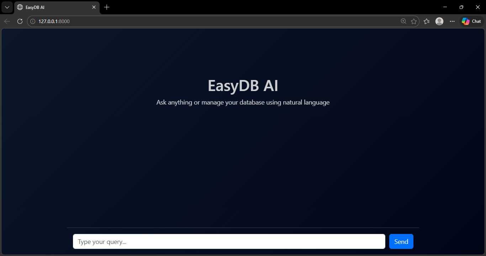
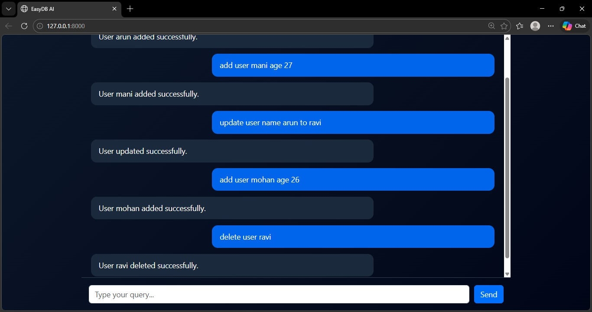
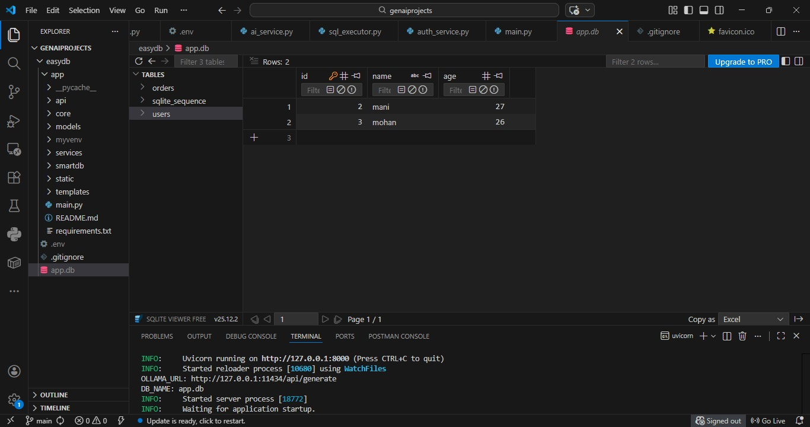

# 🚀 EasyDB AI

**EasyDB AI** is an intelligent database assistant that allows users to interact with a database using **natural language**.
It converts human queries into SQL using AI and executes them safely.

---

## 🧠 Features

* 🔹 Natural Language → SQL Conversion (AI Powered)
* 🔹 Chat Mode (General Questions)
* 🔹 Role-Based Access Control (Admin/User)
* 🔹 Auto SQL Error Fixing
* 🔹 Smart Validation (Prevents Invalid Queries)
* 🔹 Real-time Chat UI with Typing Effect
* 🔹 Table Data Rendering
* 🔹 Secure Execution with Permission Checks

---

## 🛠️ Tech Stack

### Backend

* FastAPI
* Python
* SQLite
* REST API

### AI Integration

* Ollama
* Mistral Model (or any LLM)

### Frontend

* HTML
* CSS (Bootstrap 5)
* JavaScript

---

## 📁 Project Structure

```
app/
 ├── core/
 │    ├── config.py
 │    ├── database.py
 │
 ├── models/
 │    └── schema.py
 │
 ├── services/
 │    ├── ai_service.py
 │    ├── sql_executor.py
 │    ├── auth_service.py
 │
 ├── routes/
 │    └── query_routes.py
 │
 ├── templates/
 │    └── index.html
 │
main.py
requirements.txt
.gitignore
```

---

## ⚙️ Setup Instructions

### 1️⃣ Clone Repository

```
git clone https://github.com/YOUR_USERNAME/easydb-ai.git
cd easydb-ai
```

---

### 2️⃣ Create Virtual Environment

```
python -m venv venv
venv\Scripts\activate
```

---

### 3️⃣ Install Dependencies

```
pip install -r requirements.txt
```

---

### 4️⃣ Setup Environment Variables

Create `.env` file:

```
OLLAMA_URL=http://localhost:11434/api/generate
MODEL_NAME=mistral
DB_NAME=app.db
```

---

### 5️⃣ Run Ollama Model

```
ollama run mistral
```

---

### 6️⃣ Start Server

```
uvicorn main:app --reload
```

---

### 🌐 Open in Browser

```
http://127.0.0.1:8000
```

---

## 💬 Example Queries

```
add user arun age 22
show all users
update user arun age 22 to 25
delete user arun
```

---

## 🔐 Role-Based Access

| Role  | Permissions                                  |
| ----- | -------------------------------------------- |
| Admin | Full access (insert, update, delete, select) |
| User  | Read-only (select only)                      |

---

## 🧪 Error Handling

* ❌ Missing fields → returns proper error
* ❌ Invalid SQL → auto-fix attempt
* ❌ No matching records → handled gracefully

---

## 📸 Screenshots

<p align="center">
  <br>
  <b>🏠 Home Screen</b>
</p>

<p align="center">
  <br>
  <b>💬 Chat Interaction</b>
</p>

<p align="center">
  <br>
  <b>📊 Table Output</b>
</p>


---

## 🚀 Future Improvements

* 🔥 Streaming Responses (ChatGPT style)
* 🔥 Markdown Rendering
* 🔥 Multi-table Schema Support
* 🔥 Authentication System (JWT)
* 🔥 Deployment (Docker + Cloud)

---

## 🤝 Contributing

Pull requests are welcome. For major changes, please open an issue first.

---

## 📄 License

This project is open-source and free to use.

---

## 👨‍💻 Author

**Jamal**
Python Developer | FastAPI | AI Enthusiast

---

## ⭐ Support

If you like this project, give it a ⭐ on GitHub!
